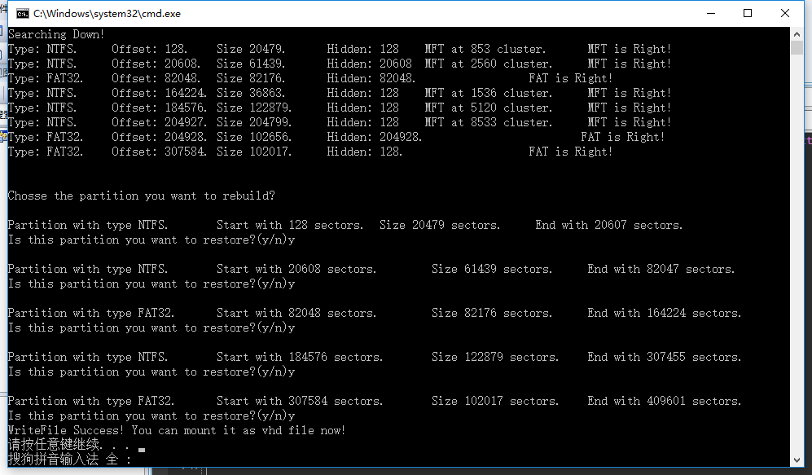
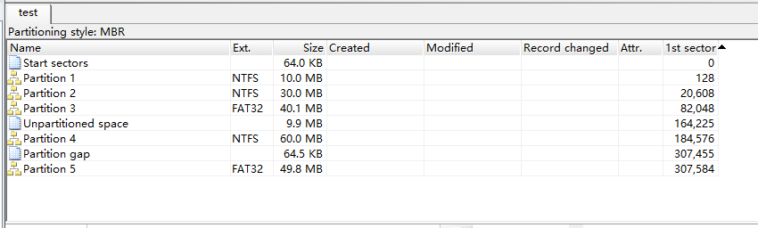
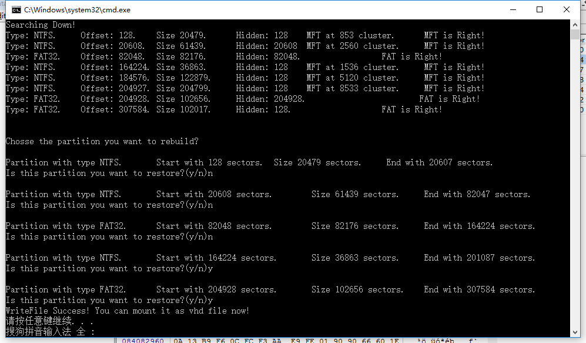
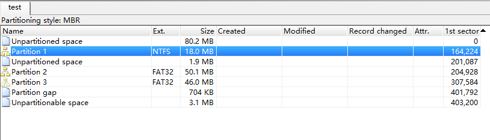

# Handle_Disk
    一个磁盘分区恢复软件，能够实现从被损坏了分区表的磁盘镜像中恢复出可能的分区表。
    教学用例代码，对Diskgenius等一些磁盘恢复软件的原理进行分析，在对磁盘结构进行分析后，提出思路并完成代码的编写。

## Usage：
    注：本程序暂未支持对本地磁盘操作。
    `hand_disk.exe [filename]`
    `filename：被损坏的磁盘镜像文件`
    
## Screenshot：
      
      
      
    
    

## Enjoy it!
